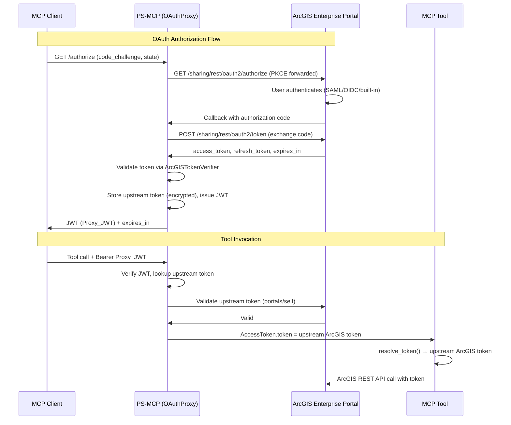
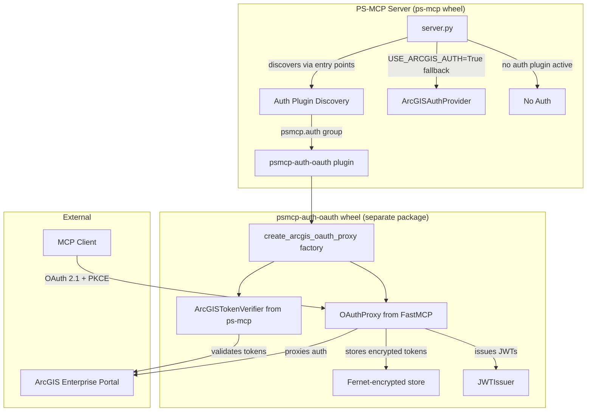
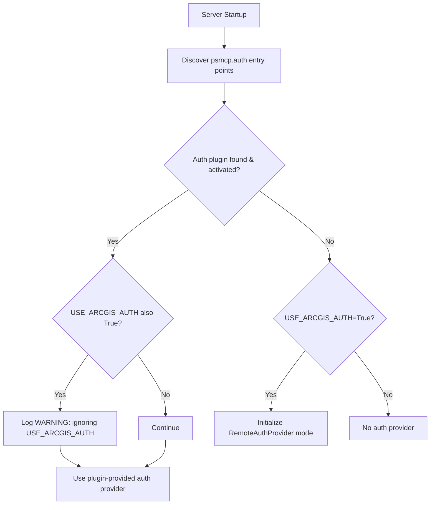
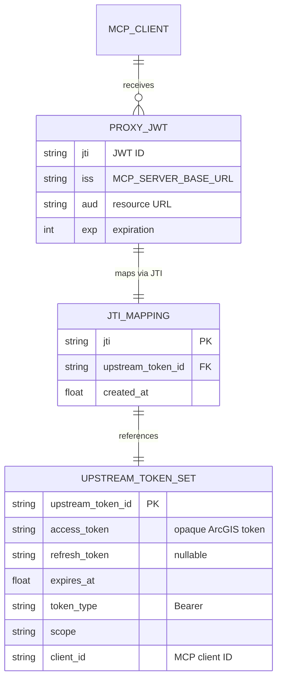

# Design Document: ArcGIS Enterprise OAuth Proxy

## Overview

This design adds an OAuth proxy mode to PS-MCP using FastMCP's `OAuthProxy` class, packaged as a **separate installable wheel** (`psmcp-auth-oauth`) that is discovered at startup via Python entry points. When the package is installed and `USE_ARCGIS_OAUTH=True` is set, the server acts as an intermediary OAuth authorization server — MCP clients authenticate using standard OAuth 2.1 flows while the server proxies authorization to the upstream ArcGIS Enterprise portal.

The key insight is that FastMCP's `OAuthProxy` handles nearly all the complexity:
- Dynamic Client Registration for MCP clients
- Authorization code flow with PKCE
- JWT issuance to clients (with encrypted upstream token inside)
- Token refresh and revocation
- OAuth metadata discovery

PS-MCP's role is to:
1. Define an auth plugin discovery mechanism (new entry point group: `psmcp.auth`)
2. Package the OAuth proxy as a standalone wheel (`psmcp-auth-oauth`) under `packages/`
3. Configure the `OAuthProxy` with ArcGIS Enterprise endpoints and credentials
4. Provide the existing `ArcGISTokenVerifier` as the token validation strategy
5. Wire plugin discovery into server initialization alongside the existing auth modes
6. Ensure `resolve_token()` continues to work transparently

### Design Rationale

**Pluggable architecture**: The OAuth proxy is packaged as a separate wheel rather than embedded in the core `ps-mcp` package. This mirrors the router plugin pattern and provides several benefits:
- The core server stays lean — deployments that don't need OAuth don't carry the dependency
- The OAuth plugin can be versioned and released independently
- Other auth plugins (e.g., Azure AD, Okta) could be added later using the same mechanism
- Installation is opt-in: `pip install psmcp-auth-oauth` or include it in the workspace

**Entry point discovery**: A new entry point group `psmcp.auth` allows the server to discover installed auth plugins at startup. The plugin exports a factory function that returns a configured auth provider. The server calls this factory when the plugin's activation condition is met (e.g., `USE_ARCGIS_OAUTH=True`).

**FastMCP OAuthProxy**: Rather than implementing OAuth flows from scratch, we leverage FastMCP's battle-tested `OAuthProxy` which already handles DCR, PKCE, state management, token encryption, and JWT issuance. The `ArcGISTokenVerifier` already satisfies the `TokenVerifier` protocol that `OAuthProxy` requires — it validates opaque ArcGIS tokens via the portal REST API and returns an `AccessToken` with user claims.

The `OAuthProxy.verify_access_token()` method decrypts the stored upstream token and passes it to our verifier. When validation succeeds, the returned `AccessToken.token` field contains the raw upstream ArcGIS token. Since `resolve_token()` calls `get_access_token().token`, tools receive the upstream ArcGIS token transparently — no changes needed in any router.

## Architecture



### Component Diagram



### Auth Mode Selection Logic



## Plugin Architecture

### Entry Point Group: `psmcp.auth`

A new entry point group `psmcp.auth` is introduced for auth provider plugins. Each plugin declares an entry point that references a factory function conforming to the `AuthPluginFactory` protocol:

```python
"""Auth plugin protocol — defined in psmcp.core.auth."""

from __future__ import annotations

from typing import Protocol, runtime_checkable

from fastmcp.server.auth import AuthProvider


@runtime_checkable
class AuthPluginFactory(Protocol):
    """Protocol for auth plugin factory functions.

    The factory is called with no arguments. It reads its own configuration
    from environment variables and returns a configured AuthProvider, or
    returns None if its activation conditions are not met (e.g., env var
    not set).

    Raises:
        Exception: If activation conditions are met but configuration is
            invalid (e.g., missing required env vars).
    """

    def __call__(self) -> AuthProvider | None: ...
```

### Discovery and Activation

The server discovers auth plugins at startup via `importlib.metadata.entry_points(group="psmcp.auth")`. It iterates through discovered plugins and calls each factory. The first factory that returns a non-None `AuthProvider` wins. If no plugin activates, the server falls back to the existing `USE_ARCGIS_AUTH` logic.

**Priority**: Auth plugins take precedence over `USE_ARCGIS_AUTH`. If a plugin activates and `USE_ARCGIS_AUTH=True` is also set, the server logs a warning and uses the plugin.

### Package Layout: `packages/psmcp-auth-oauth/`

```
packages/psmcp-auth-oauth/
├── pyproject.toml
├── README.md
└── src/
    └── psmcp_auth_oauth/
        ├── __init__.py        → exports factory + __version__
        ├── _version.py        → auto-generated by hatch-vcs (gitignored)
        └── provider.py        → factory function + OAuthProxy configuration
```

### `pyproject.toml` for `psmcp-auth-oauth`

```toml
[project]
name = "psmcp-auth-oauth"
description = "PS-MCP auth plugin: ArcGIS Enterprise OAuth proxy via FastMCP OAuthProxy."
readme = "README.md"
requires-python = ">=3.13,<3.14"
dynamic = ["version"]
dependencies = [
    "ps-mcp>=0.1.0,<1.0",
]

[project.entry-points."psmcp.auth"]
arcgis_oauth = "psmcp_auth_oauth:create_auth_provider"

[build-system]
requires = ["hatchling>=1.25", "hatch-vcs>=0.4"]
build-backend = "hatchling.build"

[tool.hatch.version]
source = "vcs"
raw-options = { root = "../.." }

[tool.hatch.build.hooks.vcs]
version-file = "src/psmcp_auth_oauth/_version.py"

[tool.hatch.build.targets.wheel]
packages = ["src/psmcp_auth_oauth"]
```

Note: The plugin depends on `ps-mcp>=0.1.0,<1.0` which provides `psmcp.core.auth.ArcGISTokenVerifier` and the `fastmcp` transitive dependency. No additional dependencies are needed since `OAuthProxy` is part of FastMCP.

## Components and Interfaces

### New Module: `packages/psmcp-auth-oauth/src/psmcp_auth_oauth/provider.py`

This module contains the factory function that creates and configures a FastMCP `OAuthProxy` instance for ArcGIS Enterprise. It conforms to the `AuthPluginFactory` protocol.

```python
"""ArcGIS Enterprise OAuth proxy plugin for PS-MCP."""

from __future__ import annotations

import logging
import os

from fastmcp.server.auth import AuthProvider
from fastmcp.server.auth.oauth_proxy import OAuthProxy

from psmcp.core.auth.arcgis_verifier import ArcGISTokenVerifier

logger = logging.getLogger(__name__)


class ArcGISOAuthConfigError(Exception):
    """Raised when required OAuth proxy configuration is missing."""


def create_auth_provider() -> AuthProvider | None:
    """Auth plugin factory: create an OAuthProxy for ArcGIS Enterprise.

    Returns None if USE_ARCGIS_OAUTH is not enabled, allowing the server
    to fall through to other auth modes. Raises ArcGISOAuthConfigError if
    enabled but misconfigured.

    Returns:
        Configured OAuthProxy instance, or None if not activated.

    Raises:
        ArcGISOAuthConfigError: If USE_ARCGIS_OAUTH=True but required
            environment variables are missing.
    """
    use_oauth = os.getenv("USE_ARCGIS_OAUTH", "").strip().lower()
    if use_oauth != "true":
        return None

    portal_url = os.getenv("ARCGIS_PORTAL_URL", "").strip()
    client_id = os.getenv("ARCGIS_OAUTH_CLIENT_ID", "").strip()
    client_secret = os.getenv("ARCGIS_OAUTH_CLIENT_SECRET", "").strip()
    base_url = os.getenv("MCP_SERVER_BASE_URL", "http://localhost:8888").strip().rstrip("/")

    missing: list[str] = []
    if not portal_url:
        missing.append("ARCGIS_PORTAL_URL")
    if not client_id:
        missing.append("ARCGIS_OAUTH_CLIENT_ID")
    if not client_secret:
        missing.append("ARCGIS_OAUTH_CLIENT_SECRET")

    if missing:
        raise ArcGISOAuthConfigError(
            f"OAuth proxy mode requires the following environment variables: "
            f"{', '.join(missing)}"
        )

    portal_url = portal_url.rstrip("/")
    verify_ssl = os.getenv("ARCGIS_VERIFY_SSL", "True").lower() == "true"

    token_verifier = ArcGISTokenVerifier(
        portal_url=portal_url,
        verify_ssl=verify_ssl,
    )

    proxy = OAuthProxy(
        upstream_authorization_endpoint=f"{portal_url}/sharing/rest/oauth2/authorize",
        upstream_token_endpoint=f"{portal_url}/sharing/rest/oauth2/token",
        upstream_client_id=client_id,
        upstream_client_secret=client_secret,
        token_verifier=token_verifier,
        base_url=base_url,
        forward_pkce=True,
        token_endpoint_auth_method="client_secret_post",
    )

    logger.info(
        "ArcGIS OAuth proxy initialized for portal: %s (base_url: %s)",
        portal_url,
        base_url,
    )

    return proxy
```

### New Module: `packages/psmcp-auth-oauth/src/psmcp_auth_oauth/__init__.py`

```python
"""PS-MCP Auth Plugin: ArcGIS Enterprise OAuth Proxy."""

from psmcp_auth_oauth.provider import ArcGISOAuthConfigError, create_auth_provider

try:
    from psmcp_auth_oauth._version import __version__
except ImportError:
    __version__ = "0.0.0+unknown"

__all__ = ["ArcGISOAuthConfigError", "create_auth_provider", "__version__"]
```

### Key Design Decisions

| Decision | Choice | Rationale |
|----------|--------|-----------|
| Separate wheel | `psmcp-auth-oauth` under `packages/` | Keeps core lean; opt-in capability; mirrors router pattern |
| Entry point group | `psmcp.auth` | Distinct from `psmcp.routers`; allows multiple auth plugins to coexist (first to activate wins) |
| Factory returns None | When `USE_ARCGIS_OAUTH != "true"` | Allows graceful fallthrough to other auth modes without raising |
| Factory raises | When activated but misconfigured | Fail-fast with clear error message naming missing vars |
| `token_endpoint_auth_method` | `"client_secret_post"` | ArcGIS Enterprise token endpoint expects credentials in the POST body, not HTTP Basic auth |
| `forward_pkce` | `True` | ArcGIS Enterprise supports PKCE with S256; forwarding ensures end-to-end protection |
| Plugin depends on `ps-mcp` | `>=0.1.0,<1.0` | Gets `ArcGISTokenVerifier` and `fastmcp` transitively; same pattern as routers |

### Modified Module: `src/psmcp/server.py`

The `_init_server()` function gains auth plugin discovery before the existing `USE_ARCGIS_AUTH` check:

```python
def _discover_auth_plugin() -> object | None:
    """Discover and activate an auth plugin via entry points.

    Iterates through installed psmcp.auth plugins. The first factory
    that returns a non-None AuthProvider wins.

    Returns:
        An AuthProvider instance, or None if no plugin activates.
    """
    eps = importlib.metadata.entry_points(group="psmcp.auth")
    for ep in eps:
        try:
            factory = ep.load()
            provider = factory()
            if provider is not None:
                logger.info("Auth plugin activated: %s", ep.name)
                return provider
        except Exception as e:
            logger.error("Auth plugin %r failed to load/activate: %s", ep.name, e)
            raise
    return None


def _init_server() -> FastMCP:
    """Create and configure the FastMCP server instance."""
    global _mcp, _mounted_routers

    if _mcp is not None:
        return _mcp

    # Auth provider selection: plugin > USE_ARCGIS_AUTH > none
    auth_provider = _discover_auth_plugin()

    if auth_provider is not None:
        if os.getenv("USE_ARCGIS_AUTH") == "True":
            logger.warning(
                "USE_ARCGIS_AUTH is set but an auth plugin is active; "
                "USE_ARCGIS_AUTH is ignored."
            )
    elif os.getenv("USE_ARCGIS_AUTH") == "True":
        from psmcp.core.auth.arcgis_provider import ArcGISAuthProvider

        auth_provider = ArcGISAuthProvider()
        logger.info("ArcGIS Enterprise authentication enabled")

    _mcp = FastMCP("ps-mcp", auth=auth_provider)
    _mounted_routers = _load_and_mount_routers(_mcp)

    @_mcp.custom_route("/health", methods=["GET"])
    async def health_check(request):
        return JSONResponse({"status": "healthy", "service": "ps-mcp"})

    return _mcp
```

### Unchanged Module: `src/psmcp/core/auth/__init__.py`

The `resolve_token()` function requires **no changes**. The `OAuthProxy.verify_access_token()` method returns an `AccessToken` where `.token` is the upstream ArcGIS token. The existing call to `get_access_token().token` in `resolve_token()` already returns this value.

### Interface: `AuthPluginFactory` Protocol

Defined in `src/psmcp/core/auth/__init__.py` (or a new `src/psmcp/core/auth/plugin.py`):

```python
@runtime_checkable
class AuthPluginFactory(Protocol):
    """Protocol for auth plugin factory functions."""

    def __call__(self) -> AuthProvider | None: ...
```

The `psmcp-auth-oauth` plugin's `create_auth_provider` function satisfies this protocol:
- Returns `None` when `USE_ARCGIS_OAUTH` is not `"true"` (plugin not activated)
- Returns a configured `OAuthProxy` when activated and properly configured
- Raises `ArcGISOAuthConfigError` when activated but misconfigured

### Interface: `ArcGISTokenVerifier` as `TokenVerifier`

The existing `ArcGISTokenVerifier` already satisfies the `TokenVerifier` protocol required by `OAuthProxy`:

```python
# Required by OAuthProxy's token_verifier parameter:
class TokenVerifier:
    required_scopes: list[str]
    async def verify_token(self, token: str) -> AccessToken | None: ...
```

`ArcGISTokenVerifier` has:
- `required_scopes` attribute (set in `__init__`)
- `verify_token(token: str) -> AccessToken | None` method

No adapter or wrapper is needed.

## Data Models

### Environment Variables (New)

| Variable | Required When | Default | Description |
|----------|--------------|---------|-------------|
| `USE_ARCGIS_OAUTH` | — | unset | Set to `"True"` (case-insensitive) to enable OAuth proxy mode |
| `ARCGIS_OAUTH_CLIENT_ID` | `USE_ARCGIS_OAUTH=True` | — | OAuth client ID registered in ArcGIS Enterprise portal |
| `ARCGIS_OAUTH_CLIENT_SECRET` | `USE_ARCGIS_OAUTH=True` | — | OAuth client secret |

### Environment Variables (Existing, Reused)

| Variable | Role in OAuth Proxy Mode |
|----------|--------------------------|
| `ARCGIS_PORTAL_URL` | Derives upstream authorization and token endpoints |
| `MCP_SERVER_BASE_URL` | Base URL for OAuth metadata and callback URLs (default: `http://localhost:8888`) |
| `ARCGIS_VERIFY_SSL` | TLS verification for token validation requests |
| `ARCGIS_TOKEN` | Fallback token in `resolve_token()` (unchanged behavior) |

### OAuth Endpoints Derived from Configuration

| Endpoint | Derivation |
|----------|-----------|
| Upstream Authorization | `{ARCGIS_PORTAL_URL}/sharing/rest/oauth2/authorize` |
| Upstream Token | `{ARCGIS_PORTAL_URL}/sharing/rest/oauth2/token` |
| Proxy Metadata | `{MCP_SERVER_BASE_URL}/.well-known/oauth-authorization-server` |
| Proxy Authorization | `{MCP_SERVER_BASE_URL}/authorize` |
| Proxy Token | `{MCP_SERVER_BASE_URL}/token` |
| Proxy Callback | `{MCP_SERVER_BASE_URL}/auth/callback` |

### Token Flow Data Model



All state is managed by FastMCP's `OAuthProxy` internally using its encrypted file-based key-value store. PS-MCP does not need to manage any of these data structures directly.

### Workspace Integration

The `psmcp-auth-oauth` package is added to the uv workspace in the root `pyproject.toml`:

```toml
[tool.uv.workspace]
members = ["packages/*"]

[tool.uv.sources]
psmcp-auth-oauth = { workspace = true }
```

After adding the package, `uv sync --all-packages` installs it in editable mode alongside the routers. The entry point is immediately discoverable by the server.

### Token Resolution Precedence (Unchanged)

```
resolve_token(token=None, required=False)
  1. explicit `token` argument → return it
  2. get_access_token().token → upstream ArcGIS token (from OAuthProxy or RemoteAuthProvider)
  3. os.getenv("ARCGIS_TOKEN") → fallback env var
  4. None (or raise ValueError if required=True)
```


## Correctness Properties

*A property is a characteristic or behavior that should hold true across all valid executions of a system — essentially, a formal statement about what the system should do. Properties serve as the bridge between human-readable specifications and machine-verifiable correctness guarantees.*

### Property 1: Configuration validation rejects incomplete environments

*For any* combination of environment variable states where `USE_ARCGIS_OAUTH` is `"true"` (case-insensitive) and at least one of `ARCGIS_PORTAL_URL`, `ARCGIS_OAUTH_CLIENT_ID`, or `ARCGIS_OAUTH_CLIENT_SECRET` is missing or empty, `create_auth_provider()` SHALL raise `ArcGISOAuthConfigError` with an error message that names every missing variable. Conversely, when all three are present and non-empty, the function SHALL return a non-None `OAuthProxy` instance.

**Validates: Requirements 1.1, 1.2, 1.3, 1.4, 1.5, 6.2, 6.3, 6.6**

### Property 2: Endpoint derivation normalizes URLs correctly

*For any* valid portal URL string (with or without trailing slashes), the derived upstream authorization endpoint SHALL equal the portal URL with trailing slashes stripped followed by `/sharing/rest/oauth2/authorize`, and the derived token endpoint SHALL equal the portal URL with trailing slashes stripped followed by `/sharing/rest/oauth2/token`. The base URL SHALL have its trailing slash stripped before use.

**Validates: Requirements 1.6, 1.7, 6.4, 6.5**

### Property 3: Plugin activation follows opt-in semantics

*For any* value of `USE_ARCGIS_OAUTH` that is NOT `"true"` (case-insensitive comparison), the factory function SHALL return `None` without raising. This includes empty string, unset, `"false"`, `"0"`, or any other value. Only the exact case-insensitive match to `"true"` activates the plugin.

**Validates: Requirements 1.8, 5.2, 6.1**

### Property 4: Auth mode selection follows precedence rules

*For any* combination of installed auth plugins and `USE_ARCGIS_AUTH` environment variable values, the server SHALL use the auth plugin's provider if any plugin returns a non-None provider. When no plugin activates, the server SHALL use `ArcGISAuthProvider` if and only if `USE_ARCGIS_AUTH` equals `"True"` (exact match). Otherwise, no auth provider is configured. If a plugin activates and `USE_ARCGIS_AUTH` is also set, a WARNING is logged.

**Validates: Requirements 5.1, 5.2, 5.3**

### Property 5: Token resolution follows three-tier precedence

*For any* combination of (explicit token argument, FastMCP auth context token, ARCGIS_TOKEN env var), `resolve_token()` SHALL return the first non-None value in precedence order: explicit argument first, auth context second, environment variable third. If all are absent and `required=False`, it SHALL return None.

**Validates: Requirements 3.3, 5.4, 5.5**

## Error Handling

### Startup Errors

| Condition | Behavior |
|-----------|----------|
| `USE_ARCGIS_OAUTH=True` + missing env vars | Raise `ArcGISOAuthConfigError` naming each missing variable. Server does not start. |
| `USE_ARCGIS_OAUTH=True` + `USE_ARCGIS_AUTH=True` | Log WARNING, proceed with OAuth proxy mode (ignore `USE_ARCGIS_AUTH`) |
| Invalid `ARCGIS_PORTAL_URL` format | `ArcGISTokenVerifier` raises `ValueError` at init |

### Runtime Errors (OAuth Flow)

| Stage | Error Condition | Response |
|-------|----------------|----------|
| Authorization | Upstream returns `error` param in callback | Forward upstream `error` + `error_description` to client |
| Token Exchange | Network timeout (>30s) | HTTP 502, `server_error`, log at ERROR |
| Token Exchange | Invalid credentials (`invalid_client` from upstream) | HTTP 401, `invalid_client` |
| Token Exchange | Token verification fails | `invalid_grant` error response |
| Token Verification | Portal unreachable | `server_error` error response |
| Tool Call | Expired/invalid Proxy_JWT | HTTP 401, `WWW-Authenticate: Bearer error="invalid_token"` |
| Tool Call | State parameter mismatch | `invalid_request` error response |

### Error Handling in `resolve_token()`

The current `resolve_token()` catches exceptions from `get_access_token()` and falls through to the env var. Per Requirement 3.4, when the OAuth proxy is active and token decryption fails, this should raise `AuthenticationError` rather than silently falling through. However, the current implementation cannot distinguish between "no auth context available" (legitimate fallthrough) and "auth context present but decryption failed" (should error).

**Approach**: The `OAuthProxy.verify_access_token()` handles decryption internally — if the JWT is invalid or the upstream token can't be found, it returns `None`, and FastMCP rejects the request with HTTP 401 before the tool is ever invoked. Therefore, if a tool is executing, the token has already been validated. The existing `resolve_token()` behavior is safe: if `get_access_token()` raises, it means no auth context exists (e.g., unauthenticated mode), and falling through to `ARCGIS_TOKEN` is correct.

No change to `resolve_token()` is needed — the OAuthProxy's middleware layer handles the decryption failure case before tool execution begins.

### Logging Strategy

All logging follows the project convention (`logger = logging.getLogger(__name__)` with lazy formatting):

- **INFO**: OAuth proxy initialization (portal URL, base URL), successful auth completions
- **WARNING**: `USE_ARCGIS_AUTH` ignored in favor of OAuth proxy, auth failures (stage + error category + client_id)
- **ERROR**: Network failures during token exchange (exception type + message)
- **DEBUG**: OAuth flow stage transitions (auth request initiated, callback received, token exchange initiated)

**Security**: Token values, authorization codes, and client secrets are NEVER logged at any level.

## Testing Strategy

### Unit Tests

Unit tests cover the plugin-specific logic (configuration, activation, token resolution) and the server's plugin discovery:

| Test | Location | What it verifies |
|------|----------|-----------------|
| `test_factory_returns_none_when_not_enabled` | `packages/psmcp-auth-oauth/tests/` | Factory returns None when USE_ARCGIS_OAUTH is unset/false |
| `test_factory_raises_missing_vars` | `packages/psmcp-auth-oauth/tests/` | Factory raises with correct error message for each missing var combination |
| `test_factory_returns_proxy_when_configured` | `packages/psmcp-auth-oauth/tests/` | Factory returns OAuthProxy when all vars present |
| `test_endpoint_derivation` | `packages/psmcp-auth-oauth/tests/` | Correct URL construction with trailing slash handling |
| `test_oauth_case_insensitive` | `packages/psmcp-auth-oauth/tests/` | `"true"`, `"True"`, `"TRUE"` all activate; other values don't |
| `test_discover_auth_plugin` | `tests/` (core) | Server discovers and activates installed auth plugin |
| `test_plugin_precedence_over_use_arcgis_auth` | `tests/` (core) | Plugin wins over USE_ARCGIS_AUTH, warning logged |
| `test_fallback_to_use_arcgis_auth` | `tests/` (core) | When no plugin activates, USE_ARCGIS_AUTH still works |
| `test_no_plugin_no_auth` | `tests/` (core) | When no plugin and no USE_ARCGIS_AUTH, no auth provider |
| `test_resolve_token_precedence` | `tests/` (core) | Three-tier resolution order (unchanged) |

### Property-Based Tests

Property-based tests use `hypothesis` (already compatible with the project's pytest setup) to verify universal properties across generated inputs.

**Configuration**: Minimum 100 iterations per property test.

**Library**: `hypothesis` (Python PBT library, well-supported with pytest)

**Tag format**: Each test is tagged with a comment referencing the design property:
```python
# Feature: arcgis-enterprise-oauth, Property 1: Configuration validation rejects incomplete environments
```

| Property Test | Generators | Assertion |
|---------------|-----------|-----------|
| Config validation | Random subsets of {portal_url, client_id, client_secret} as present/empty/absent | Raises iff any var missing; error names all missing vars |
| Endpoint derivation | Random URL strings with 0-3 trailing slashes | No double slashes; correct path appended |
| Plugin activation | Random strings for USE_ARCGIS_OAUTH | Returns None iff lowercase != "true" |
| Mode selection | Monkeypatched entry points + random USE_ARCGIS_AUTH values | Plugin wins when active; fallback works when inactive |
| Token precedence | Random Optional[str] for each tier | Returns first non-None in order |

### Integration Tests

Integration tests (marked `@pytest.mark.integration`) require a running PS-MCP server with the OAuth plugin installed and a reachable ArcGIS Enterprise portal:

- OAuth metadata discovery endpoint returns valid JSON
- Full authorization code flow with test credentials
- Token verification against portal
- Tool invocation with valid Proxy_JWT
- `psmcp router list` shows the auth plugin status

### Mocking Strategy

- **`httpx` calls**: Use `respx` or `pytest-httpx` to mock ArcGIS portal REST API responses
- **Environment variables**: Use `monkeypatch.setenv()` / `monkeypatch.delenv()` via pytest fixtures
- **Entry points**: Use `fake_router_entry_points`-style fixture for `psmcp.auth` group (monkeypatch `importlib.metadata.entry_points`)
- **FastMCP auth context**: Mock `get_access_token()` to return controlled `AccessToken` instances
- **OAuthProxy internals**: Not mocked — tested via the factory function's output configuration
