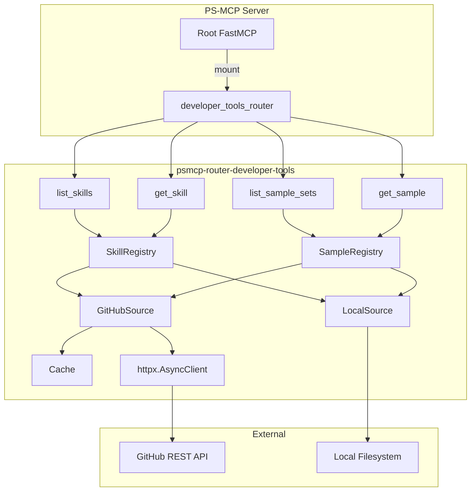

# Design Document: Developer Tools Router

## Overview

The `psmcp-router-developer-tools` package is a PS-MCP router plugin that exposes developer productivity tools as MCP tools. It provides LLM clients with access to curated skill documents (markdown files with YAML front matter) and code sample sets sourced from GitHub repositories and local filesystem directories.

This router ports the core functionality of the Go-based `ps-codex-mcp` server into the PS-MCP Python ecosystem, adding local filesystem support as a first-class source type alongside GitHub. The four tools exposed are: `list_skills`, `get_skill`, `list_sample_sets`, and `get_sample`.

### Design Decisions

1. **Dual source abstraction**: A common `Source` protocol unifies GitHub and local filesystem access, allowing tools to operate source-agnostically.
2. **In-memory TTL cache for GitHub only**: Local filesystem reads are always fresh; GitHub content is cached with a configurable TTL to reduce API calls.
3. **Eager loading on first access**: Skills and samples are loaded lazily on first tool invocation, then cached. This avoids startup delays when the router is mounted but not used.
4. **Reference resolution at read time**: Relative `.md` links in skill content are resolved when `get_skill` is called, not at load time, to keep the cache simple.
5. **Simple text search for samples**: File content matching uses case-insensitive substring/keyword search rather than a full-text search engine, keeping dependencies minimal.

## Architecture



### Package Layout

```
packages/psmcp-router-developer-tools/
├── pyproject.toml
├── README.md
└── src/
    └── psmcp_router_developer_tools/
        ├── __init__.py          → exports router + __version__
        ├── _version.py          → auto-generated by hatch-vcs
        ├── service.py           → FastMCP instance + tool definitions
        ├── config.py            → environment variable parsing
        ├── models.py            → data classes for skills, sources, samples
        ├── parsing.py           → YAML front matter parsing, reference resolution
        ├── sources/
        │   ├── __init__.py
        │   ├── base.py          → Source protocol definition
        │   ├── github.py        → GitHub API source implementation
        │   └── local.py         → Local filesystem source implementation
        ├── cache.py             → TTL-based in-memory cache
        ├── registry.py          → SkillRegistry and SampleRegistry
        └── search.py            → Text search logic for samples
```

## Components and Interfaces

### 1. Configuration (`config.py`)

Reads environment variables at module import time per project conventions.

```python
"""Environment-based configuration for the developer-tools router."""

import json
import logging
import os

logger = logging.getLogger(__name__)

GITHUB_TOKEN: str | None = os.getenv("GITHUB_TOKEN")
CACHE_TTL_MINUTES: int = int(os.getenv("DEVTOOLS_CACHE_TTL_MINUTES", "60"))

def load_skill_sources() -> list[dict]:
    """Parse DEVTOOLS_SKILL_SOURCES JSON env var.

    Returns:
        List of source config dicts. Empty list on parse failure.
    """
    raw = os.getenv("DEVTOOLS_SKILL_SOURCES", "")
    if not raw:
        return []
    try:
        sources = json.loads(raw)
        if not isinstance(sources, list):
            logger.error("DEVTOOLS_SKILL_SOURCES must be a JSON array")
            return []
        return sources
    except json.JSONDecodeError as e:
        logger.error("Invalid JSON in DEVTOOLS_SKILL_SOURCES: %s", e)
        return []

def load_sample_sources() -> list[dict]:
    """Parse DEVTOOLS_SAMPLE_SOURCES JSON env var.

    Returns:
        List of source config dicts. Empty list on parse failure.
    """
    raw = os.getenv("DEVTOOLS_SAMPLE_SOURCES", "")
    if not raw:
        return []
    try:
        sources = json.loads(raw)
        if not isinstance(sources, list):
            logger.error("DEVTOOLS_SAMPLE_SOURCES must be a JSON array")
            return []
        return sources
    except json.JSONDecodeError as e:
        logger.error("Invalid JSON in DEVTOOLS_SAMPLE_SOURCES: %s", e)
        return []
```

### 2. Data Models (`models.py`)

```python
"""Data models for the developer-tools router."""

from dataclasses import dataclass, field


@dataclass(frozen=True)
class SkillMetadata:
    """Parsed front matter metadata for a skill file."""

    name: str
    description: str = ""
    tags: list[str] = field(default_factory=list)
    source_id: str = ""


@dataclass(frozen=True)
class Skill:
    """A complete skill with metadata and content."""

    metadata: SkillMetadata
    content: str
    file_path: str  # relative path within the source


@dataclass(frozen=True)
class SkillSummary:
    """Lightweight skill info returned by list_skills."""

    name: str
    description: str
    tags: list[str]
    source: str


@dataclass(frozen=True)
class SampleSetConfig:
    """Configuration for a sample set source."""

    name: str
    source_type: str  # "github" or "local"
    url: str = ""     # GitHub repo URL (for github type)
    path: str = ""    # Local directory path (for local type)
    languages: list[str] = field(default_factory=list)
    apis: list[str] = field(default_factory=list)


@dataclass(frozen=True)
class SampleSetSummary:
    """Summary info returned by list_sample_sets."""

    name: str
    source_type: str
    languages: list[str] = field(default_factory=list)
    apis: list[str] = field(default_factory=list)


@dataclass(frozen=True)
class SampleResult:
    """A single code sample search result."""

    file_path: str
    content: str
    relevance_score: float = 0.0
```

### 3. Source Protocol (`sources/base.py`)

```python
"""Abstract base for content sources."""

from typing import Protocol

from psmcp_router_developer_tools.models import Skill


class SkillSource(Protocol):
    """Protocol for loading skills from a source."""

    @property
    def source_id(self) -> str: ...

    async def load_skills(self) -> list[Skill]: ...

    async def read_file(self, relative_path: str) -> str | None:
        """Read a file by relative path for reference resolution."""
        ...


class SampleSource(Protocol):
    """Protocol for searching samples in a source."""

    @property
    def source_id(self) -> str: ...

    async def search(self, query: str) -> list[tuple[str, str, float]]:
        """Search for files matching query.

        Returns:
            List of (file_path, content, relevance_score) tuples.
        """
        ...
```

### 4. GitHub Source (`sources/github.py`)

```python
"""GitHub-backed source implementation."""

import logging
from pathlib import PurePosixPath

import httpx

from psmcp_router_developer_tools.cache import TTLCache
from psmcp_router_developer_tools.config import GITHUB_TOKEN
from psmcp_router_developer_tools.models import Skill
from psmcp_router_developer_tools.parsing import parse_skill_file

logger = logging.getLogger(__name__)


class GitHubSkillSource:
    """Loads skills from a GitHub repository.

    Uses the GitHub Trees API to list files and the raw content API
    to fetch individual files. Results are cached via the shared TTLCache.
    """

    def __init__(self, url: str, cache: TTLCache, token: str | None = None):
        self._url = url  # e.g. "https://github.com/owner/repo"
        self._cache = cache
        self._token = token or GITHUB_TOKEN
        self._owner, self._repo = self._parse_github_url(url)

    @property
    def source_id(self) -> str:
        return f"github:{self._owner}/{self._repo}"

    async def load_skills(self) -> list[Skill]:
        """Fetch all .md files from the repo, parse as skills."""
        cached = self._cache.get(f"skills:{self.source_id}")
        if cached is not None:
            return cached

        skills = []
        tree = await self._fetch_tree()
        for item in tree:
            path = item.get("path", "")
            if not path.endswith(".md"):
                continue
            if self._is_dot_directory(path):
                continue
            content = await self._fetch_file_content(path)
            if content is None:
                continue
            skill = parse_skill_file(content, path, self.source_id)
            if skill is not None:
                skills.append(skill)

        self._cache.set(f"skills:{self.source_id}", skills)
        return skills

    async def read_file(self, relative_path: str) -> str | None:
        """Read a single file from the repo for reference resolution."""
        cache_key = f"file:{self.source_id}:{relative_path}"
        cached = self._cache.get(cache_key)
        if cached is not None:
            return cached
        content = await self._fetch_file_content(relative_path)
        if content is not None:
            self._cache.set(cache_key, content)
        return content

    async def _fetch_tree(self) -> list[dict]:
        """Fetch the full repo tree via GitHub Trees API."""
        url = f"https://api.github.com/repos/{self._owner}/{self._repo}/git/trees/main"
        headers = self._auth_headers()
        params = {"recursive": "1"}
        async with httpx.AsyncClient(timeout=30.0) as client:
            resp = await client.get(url, headers=headers, params=params)
            resp.raise_for_status()
            data = resp.json()
            return data.get("tree", [])

    async def _fetch_file_content(self, path: str) -> str | None:
        """Fetch raw file content from GitHub."""
        url = (
            f"https://raw.githubusercontent.com/"
            f"{self._owner}/{self._repo}/main/{path}"
        )
        headers = self._auth_headers()
        async with httpx.AsyncClient(timeout=30.0) as client:
            resp = await client.get(url, headers=headers)
            if resp.status_code == 404:
                return None
            resp.raise_for_status()
            return resp.text

    def _auth_headers(self) -> dict[str, str]:
        headers: dict[str, str] = {"Accept": "application/vnd.github.v3+json"}
        if self._token:
            headers["Authorization"] = f"Bearer {self._token}"
        return headers

    @staticmethod
    def _parse_github_url(url: str) -> tuple[str, str]:
        """Extract owner and repo from a GitHub URL."""
        # Handles https://github.com/owner/repo or github.com/owner/repo
        parts = url.rstrip("/").split("/")
        return parts[-2], parts[-1]

    @staticmethod
    def _is_dot_directory(path: str) -> bool:
        """Check if any path component starts with a dot."""
        return any(part.startswith(".") for part in PurePosixPath(path).parts[:-1])
```

### 5. Local Source (`sources/local.py`)

```python
"""Local filesystem source implementation."""

import logging
from pathlib import Path

from psmcp_router_developer_tools.models import Skill
from psmcp_router_developer_tools.parsing import parse_skill_file

logger = logging.getLogger(__name__)


class LocalSkillSource:
    """Loads skills from a local filesystem directory."""

    def __init__(self, path: str, source_id: str | None = None):
        self._path = Path(path)
        self._source_id = source_id or f"local:{path}"

    @property
    def source_id(self) -> str:
        return self._source_id

    async def load_skills(self) -> list[Skill]:
        """Read all .md files from the directory, parse as skills."""
        if not self._path.is_dir():
            logger.warning("Skill source path does not exist: %s", self._path)
            return []

        skills = []
        for md_file in self._path.rglob("*.md"):
            # Skip dot-directories
            relative = md_file.relative_to(self._path)
            if any(part.startswith(".") for part in relative.parts[:-1]):
                continue

            try:
                content = md_file.read_text(encoding="utf-8")
            except OSError as e:
                logger.warning("Failed to read %s: %s", md_file, e)
                continue

            skill = parse_skill_file(content, str(relative), self.source_id)
            if skill is not None:
                skills.append(skill)

        return skills

    async def read_file(self, relative_path: str) -> str | None:
        """Read a file relative to the source directory."""
        target = self._path / relative_path
        if not target.is_file():
            return None
        try:
            return target.read_text(encoding="utf-8")
        except OSError as e:
            logger.warning("Failed to read referenced file %s: %s", target, e)
            return None


class LocalSampleSource:
    """Searches code samples in a local directory."""

    def __init__(self, path: str, name: str):
        self._path = Path(path)
        self._name = name

    @property
    def source_id(self) -> str:
        return f"local:{self._name}"

    async def search(self, query: str) -> list[tuple[str, str, float]]:
        """Search files for query matches using case-insensitive substring matching."""
        if not self._path.is_dir():
            logger.warning("Sample source path does not exist: %s", self._path)
            return []

        results: list[tuple[str, str, float]] = []
        query_lower = query.lower()
        query_terms = query_lower.split()

        for file_path in self._path.rglob("*"):
            if not file_path.is_file():
                continue
            relative = file_path.relative_to(self._path)
            if any(part.startswith(".") for part in relative.parts):
                continue
            # Skip binary files by extension
            if file_path.suffix in {".png", ".jpg", ".gif", ".ico", ".woff", ".ttf"}:
                continue

            try:
                content = file_path.read_text(encoding="utf-8")
            except (OSError, UnicodeDecodeError):
                continue

            score = _compute_relevance(content, str(relative), query_terms)
            if score > 0:
                results.append((str(relative), content, score))

        results.sort(key=lambda r: r[2], reverse=True)
        return results


def _compute_relevance(
    content: str, file_path: str, query_terms: list[str]
) -> float:
    """Compute a simple relevance score based on term frequency.

    Args:
        content: File content.
        file_path: Relative file path.
        query_terms: Lowercased search terms.

    Returns:
        Score >= 0. Higher means more relevant.
    """
    content_lower = content.lower()
    path_lower = file_path.lower()
    score = 0.0

    for term in query_terms:
        # Path matches are weighted higher
        if term in path_lower:
            score += 3.0
        # Content matches
        count = content_lower.count(term)
        if count > 0:
            score += min(count, 10)  # Cap per-term contribution

    return score
```

### 6. Cache (`cache.py`)

```python
"""Simple TTL-based in-memory cache."""

import time
from typing import Any


class TTLCache:
    """Thread-safe in-memory cache with time-based expiration.

    Not truly thread-safe for asyncio (no locks needed for single-threaded
    event loop), but entries expire based on wall-clock time.
    """

    def __init__(self, ttl_seconds: int):
        self._ttl = ttl_seconds
        self._store: dict[str, tuple[float, Any]] = {}

    def get(self, key: str) -> Any | None:
        """Get a cached value if it exists and hasn't expired."""
        entry = self._store.get(key)
        if entry is None:
            return None
        timestamp, value = entry
        if time.monotonic() - timestamp > self._ttl:
            del self._store[key]
            return None
        return value

    def set(self, key: str, value: Any) -> None:
        """Store a value with the current timestamp."""
        self._store[key] = (time.monotonic(), value)

    def clear(self) -> None:
        """Clear all cached entries."""
        self._store.clear()
```

### 7. Parsing (`parsing.py`)

```python
"""YAML front matter parsing and reference resolution."""

import logging
import re
from pathlib import PurePosixPath

from psmcp_router_developer_tools.models import Skill, SkillMetadata

logger = logging.getLogger(__name__)

# Regex for YAML front matter delimited by ---
_FRONT_MATTER_RE = re.compile(r"^---\s*\n(.*?)\n---\s*\n", re.DOTALL)

# Regex for relative markdown links: [label](path.md)
_MD_LINK_RE = re.compile(r"\[([^\]]*)\]\(([^)]+\.md)\)")


def parse_front_matter(text: str) -> tuple[dict, str]:
    """Split a markdown file into front matter dict and body.

    Args:
        text: Raw file content.

    Returns:
        Tuple of (front_matter_dict, body_text).
        Returns ({}, full_text) if no valid front matter found.
    """
    import yaml  # lazy import to keep module load fast

    match = _FRONT_MATTER_RE.match(text)
    if not match:
        return {}, text

    yaml_str = match.group(1)
    body = text[match.end():]

    try:
        fm = yaml.safe_load(yaml_str)
        if not isinstance(fm, dict):
            return {}, text
        return fm, body
    except yaml.YAMLError as e:
        logger.warning("Invalid YAML front matter: %s", e)
        return {}, text


def parse_skill_file(
    content: str, file_path: str, source_id: str
) -> Skill | None:
    """Parse a markdown file into a Skill object.

    Args:
        content: Raw file content.
        file_path: Relative path within the source.
        source_id: Identifier of the source this file came from.

    Returns:
        Skill object, or None if the file is invalid (missing name, bad YAML).
    """
    fm, body = parse_front_matter(content)

    if not fm:
        logger.warning("Skipping %s: no valid front matter", file_path)
        return None

    name = fm.get("name", "").strip()
    if not name:
        logger.warning("Skipping %s: empty name field", file_path)
        return None

    description = fm.get("description", "")

    # Merge tags from top-level and metadata.tags, deduplicate, normalize
    tags = _merge_tags(fm)

    metadata = SkillMetadata(
        name=name,
        description=description,
        tags=tags,
        source_id=source_id,
    )
    return Skill(metadata=metadata, content=body, file_path=file_path)


def _merge_tags(fm: dict) -> list[str]:
    """Merge and normalize tags from front matter.

    Combines top-level 'tags' and 'metadata.tags', deduplicates,
    and normalizes to lowercase.
    """
    raw_tags: list[str] = []

    top_tags = fm.get("tags")
    if isinstance(top_tags, list):
        raw_tags.extend(str(t) for t in top_tags)
    elif isinstance(top_tags, str):
        raw_tags.append(top_tags)

    metadata = fm.get("metadata")
    if isinstance(metadata, dict):
        meta_tags = metadata.get("tags")
        if isinstance(meta_tags, list):
            raw_tags.extend(str(t) for t in meta_tags)
        elif isinstance(meta_tags, str):
            raw_tags.append(meta_tags)

    # Normalize and deduplicate preserving order
    seen: set[str] = set()
    result: list[str] = []
    for tag in raw_tags:
        normalized = tag.strip().lower()
        if normalized and normalized not in seen:
            seen.add(normalized)
            result.append(normalized)
    return result


def find_relative_references(content: str) -> list[tuple[str, str]]:
    """Find relative .md file references in skill content.

    Args:
        content: Markdown body text.

    Returns:
        List of (label, relative_path) tuples for .md links.
    """
    refs = []
    for match in _MD_LINK_RE.finditer(content):
        label = match.group(1)
        path = match.group(2)
        # Only include relative paths (not http:// or absolute)
        if not path.startswith(("http://", "https://", "/")):
            refs.append((label, path))
    return refs


def resolve_reference_path(skill_file_path: str, reference: str) -> str:
    """Resolve a relative reference path against the skill file's directory.

    Args:
        skill_file_path: The skill file's path within the source.
        reference: The relative path from the markdown link.

    Returns:
        Resolved path relative to the source root.
    """
    skill_dir = PurePosixPath(skill_file_path).parent
    resolved = skill_dir / reference
    # Normalize (resolve ..)
    return str(PurePosixPath(*resolved.parts))
```

### 8. Registry (`registry.py`)

```python
"""Skill and sample registries that coordinate sources."""

import logging

from psmcp_router_developer_tools.models import (
    SampleResult,
    SampleSetConfig,
    SampleSetSummary,
    Skill,
    SkillSummary,
)
from psmcp_router_developer_tools.parsing import (
    find_relative_references,
    resolve_reference_path,
)
from psmcp_router_developer_tools.sources.base import SampleSource, SkillSource

logger = logging.getLogger(__name__)


class SkillRegistry:
    """Manages skill loading and lookup across multiple sources."""

    def __init__(self, sources: list[SkillSource]):
        self._sources = sources
        self._skills: list[Skill] | None = None
        self._by_name: dict[str, tuple[Skill, SkillSource]] | None = None

    async def _ensure_loaded(self) -> None:
        """Load skills from all sources on first access."""
        if self._skills is not None:
            return
        self._skills = []
        self._by_name = {}
        for source in self._sources:
            try:
                skills = await source.load_skills()
                for skill in skills:
                    self._skills.append(skill)
                    self._by_name[skill.metadata.name.lower()] = (skill, source)
            except Exception as e:
                logger.error(
                    "Failed to load skills from %s: %s", source.source_id, e
                )

    async def list_skills(self, tags: list[str] | None = None) -> list[SkillSummary]:
        """List all skills, optionally filtered by tags."""
        await self._ensure_loaded()
        assert self._skills is not None

        filter_tags = {t.lower() for t in tags} if tags else None
        results = []
        for skill in self._skills:
            if filter_tags:
                if not any(t in filter_tags for t in skill.metadata.tags):
                    continue
            results.append(
                SkillSummary(
                    name=skill.metadata.name,
                    description=skill.metadata.description,
                    tags=skill.metadata.tags,
                    source=skill.metadata.source_id,
                )
            )
        return results

    async def get_skill(self, name: str) -> tuple[Skill, SkillSource] | None:
        """Look up a skill by name (case-insensitive)."""
        await self._ensure_loaded()
        assert self._by_name is not None
        return self._by_name.get(name.lower())

    async def get_available_names(self) -> list[str]:
        """Return all loaded skill names."""
        await self._ensure_loaded()
        assert self._skills is not None
        return [s.metadata.name for s in self._skills]


class SampleRegistry:
    """Manages sample set lookup and search."""

    def __init__(
        self, configs: list[SampleSetConfig], sources: dict[str, SampleSource]
    ):
        self._configs = configs
        self._sources = sources  # keyed by sample set name

    def list_sample_sets(self) -> list[SampleSetSummary]:
        """List all configured sample sets."""
        return [
            SampleSetSummary(
                name=cfg.name,
                source_type=cfg.source_type,
                languages=cfg.languages,
                apis=cfg.apis,
            )
            for cfg in self._configs
        ]

    async def search(
        self, sample_set_name: str, query: str
    ) -> list[SampleResult] | None:
        """Search within a named sample set.

        Returns:
            List of results, or None if sample set not found.
        """
        source = self._sources.get(sample_set_name)
        if source is None:
            return None

        raw_results = await source.search(query)
        return [
            SampleResult(file_path=path, content=content, relevance_score=score)
            for path, content, score in raw_results
        ]

    def get_available_names(self) -> list[str]:
        """Return all configured sample set names."""
        return [cfg.name for cfg in self._configs]
```

### 9. Service / Tool Definitions (`service.py`)

```python
"""Developer Tools MCP Router — tool definitions."""

import logging

from fastmcp import FastMCP

from psmcp_router_developer_tools.config import (
    CACHE_TTL_MINUTES,
    load_sample_sources,
    load_skill_sources,
)
from psmcp_router_developer_tools.cache import TTLCache
from psmcp_router_developer_tools.models import SampleSetConfig
from psmcp_router_developer_tools.parsing import (
    find_relative_references,
    resolve_reference_path,
)
from psmcp_router_developer_tools.registry import SampleRegistry, SkillRegistry
from psmcp_router_developer_tools.sources.github import GitHubSampleSource, GitHubSkillSource
from psmcp_router_developer_tools.sources.local import LocalSampleSource, LocalSkillSource

logger = logging.getLogger(__name__)

developer_tools_router = FastMCP(name="Developer Tools Router")

# --- Initialization (lazy, built on first tool call) ---

_skill_registry: SkillRegistry | None = None
_sample_registry: SampleRegistry | None = None
_cache = TTLCache(ttl_seconds=CACHE_TTL_MINUTES * 60)


def _build_skill_registry() -> SkillRegistry:
    """Construct the skill registry from environment config."""
    sources = []
    for cfg in load_skill_sources():
        src_type = cfg.get("type", "")
        if src_type == "github":
            sources.append(GitHubSkillSource(url=cfg["url"], cache=_cache))
        elif src_type == "local":
            sources.append(LocalSkillSource(path=cfg["path"]))
        else:
            logger.warning("Unknown skill source type: %s", src_type)
    return SkillRegistry(sources)


def _build_sample_registry() -> SampleRegistry:
    """Construct the sample registry from environment config."""
    configs = []
    sources: dict[str, object] = {}
    for cfg in load_sample_sources():
        src_type = cfg.get("type", "")
        name = cfg.get("name", "")
        if not name:
            logger.warning("Sample source missing 'name', skipping")
            continue

        sample_cfg = SampleSetConfig(
            name=name,
            source_type=src_type,
            url=cfg.get("url", ""),
            path=cfg.get("path", ""),
            languages=cfg.get("languages", []),
            apis=cfg.get("apis", []),
        )
        configs.append(sample_cfg)

        if src_type == "github":
            sources[name] = GitHubSampleSource(url=cfg["url"], name=name, cache=_cache)
        elif src_type == "local":
            sources[name] = LocalSampleSource(path=cfg["path"], name=name)
        else:
            logger.warning("Unknown sample source type: %s", src_type)

    return SampleRegistry(configs, sources)


def _get_skill_registry() -> SkillRegistry:
    global _skill_registry
    if _skill_registry is None:
        _skill_registry = _build_skill_registry()
    return _skill_registry


def _get_sample_registry() -> SampleRegistry:
    global _sample_registry
    if _sample_registry is None:
        _sample_registry = _build_sample_registry()
    return _sample_registry


# --- Tools ---


@developer_tools_router.tool
async def list_skills(tags: list[str] | None = None) -> dict:
    """List available developer skill documents with optional tag filtering.

    Skills are curated markdown guidance documents with metadata. Use this tool
    to discover what skills are available, optionally filtering by tags.

    Args:
        tags: Optional list of tags to filter by. Returns skills matching
              at least one of the specified tags. Case-insensitive.

    Returns:
        Dict with 'skills' list containing name, description, tags, and source
        for each matching skill.
    """
    registry = _get_skill_registry()
    skills = await registry.list_skills(tags=tags)
    return {
        "skills": [
            {
                "name": s.name,
                "description": s.description,
                "tags": s.tags,
                "source": s.source,
            }
            for s in skills
        ],
        "total": len(skills),
    }


@developer_tools_router.tool
async def get_skill(name: str) -> dict:
    """Retrieve the full content of a specific skill by name.

    Returns the complete markdown content including resolved references
    to other .md files linked within the skill.

    Args:
        name: The name of the skill to retrieve (case-insensitive).

    Returns:
        Dict with skill metadata and full content, including any resolved
        references appended as additional sections.
    """
    registry = _get_skill_registry()
    result = await registry.get_skill(name)

    if result is None:
        available = await registry.get_available_names()
        return {
            "error": f"Skill '{name}' not found.",
            "available_skills": available,
        }

    skill, source = result

    # Resolve relative .md references
    references = find_relative_references(skill.content)
    resolved_sections: list[dict] = []

    for label, ref_path in references:
        resolved_path = resolve_reference_path(skill.file_path, ref_path)
        ref_content = await source.read_file(resolved_path)
        if ref_content is not None:
            resolved_sections.append({
                "label": label,
                "path": ref_path,
                "content": ref_content,
            })
        else:
            resolved_sections.append({
                "label": label,
                "path": ref_path,
                "error": f"Could not resolve reference: {ref_path}",
            })

    return {
        "name": skill.metadata.name,
        "description": skill.metadata.description,
        "tags": skill.metadata.tags,
        "source": skill.metadata.source_id,
        "content": skill.content,
        "references": resolved_sections,
    }


@developer_tools_router.tool
async def list_sample_sets() -> dict:
    """List configured code sample collections.

    Returns all available sample sets with their metadata including
    source type, supported languages, and APIs/frameworks.

    Returns:
        Dict with 'sample_sets' list. Empty list with a message if none configured.
    """
    registry = _get_sample_registry()
    sets = registry.list_sample_sets()

    if not sets:
        return {
            "sample_sets": [],
            "message": "No sample sets are configured.",
        }

    return {
        "sample_sets": [
            {
                "name": s.name,
                "source_type": s.source_type,
                "languages": s.languages,
                "apis": s.apis,
            }
            for s in sets
        ],
        "total": len(sets),
    }


@developer_tools_router.tool
async def get_sample(sample_set: str, query: str) -> dict:
    """Search for code samples within a specific sample set.

    Searches file names and content within the specified sample collection,
    returning results ranked by text relevance.

    Args:
        sample_set: Name of the sample set to search within.
        query: Search query string (searches file paths and content).

    Returns:
        Dict with ranked 'results' list containing file_path and content,
        or an error with available sample set names if not found.
    """
    registry = _get_sample_registry()
    results = await registry.search(sample_set, query)

    if results is None:
        available = registry.get_available_names()
        return {
            "error": f"Sample set '{sample_set}' not found.",
            "available_sample_sets": available,
        }

    if not results:
        return {
            "results": [],
            "query": query,
            "sample_set": sample_set,
        }

    return {
        "results": [
            {
                "file_path": r.file_path,
                "content": r.content,
                "relevance_score": r.relevance_score,
            }
            for r in results
        ],
        "query": query,
        "sample_set": sample_set,
        "total": len(results),
    }
```

## Data Models

### Environment Variable Schema

| Variable | Type | Default | Description |
|----------|------|---------|-------------|
| `DEVTOOLS_SKILL_SOURCES` | JSON string | `""` | Array of skill source configs |
| `DEVTOOLS_SAMPLE_SOURCES` | JSON string | `""` | Array of sample set configs |
| `GITHUB_TOKEN` | string | `None` | GitHub API token for private repos |
| `DEVTOOLS_CACHE_TTL_MINUTES` | int | `60` | Cache TTL for GitHub content |

### Skill Source Config (JSON element)

```json
{
  "type": "github",
  "url": "https://github.com/EsriPS/agent-skills"
}
```

```json
{
  "type": "local",
  "path": "/path/to/skills/directory"
}
```

### Sample Source Config (JSON element)

```json
{
  "type": "github",
  "name": "arcgis-python-samples",
  "url": "https://github.com/EsriPS/arcgis-samples",
  "languages": ["python"],
  "apis": ["arcgis-api-for-python"]
}
```

```json
{
  "type": "local",
  "name": "local-templates",
  "path": "/opt/samples/templates",
  "languages": ["python", "javascript"],
  "apis": ["maps-sdk"]
}
```

### Skill File Format (Markdown with YAML Front Matter)

```markdown
---
name: Best Practices Guide
description: Code quality and naming conventions
tags:
  - best-practices
  - code-quality
metadata:
  tags:
    - python
---

# Best Practices Guide

Content body here...

See also: [Testing Guide](testing-guide.md)
```

### Cache Entry Structure

```
Key: "skills:{source_id}" | "file:{source_id}:{path}" | "tree:{source_id}"
Value: (timestamp: float, data: Any)
TTL: DEVTOOLS_CACHE_TTL_MINUTES * 60 seconds
```


## Correctness Properties

*A property is a characteristic or behavior that should hold true across all valid executions of a system—essentially, a formal statement about what the system should do. Properties serve as the bridge between human-readable specifications and machine-verifiable correctness guarantees.*

### Property 1: Tag filtering returns exact matching subset

*For any* set of skills with arbitrary tags and *for any* set of filter tags, `list_skills(tags=filter_tags)` SHALL return exactly the subset of skills where at least one of the skill's normalized tags appears in the normalized filter set — no more, no less.

**Validates: Requirements 1.2**

### Property 2: Dot-directory exclusion

*For any* file path string, the dot-directory filter SHALL return `True` (skip) if and only if at least one directory component (excluding the filename) starts with a dot character.

**Validates: Requirements 1.5**

### Property 3: Invalid skill files are rejected

*For any* markdown string that either (a) has no `---` delimited front matter block, (b) has YAML that fails to parse, or (c) has an empty or missing `name` field, `parse_skill_file` SHALL return `None`.

**Validates: Requirements 1.6, 6.3**

### Property 4: Cache TTL expiration

*For any* key-value pair stored in the TTLCache, `get(key)` SHALL return the stored value when called before the TTL has elapsed, and SHALL return `None` when called after the TTL has elapsed.

**Validates: Requirements 1.7, 7.1, 7.2, 7.3**

### Property 5: Skill lookup by name is case-insensitive

*For any* skill loaded into the registry, `get_skill(name)` SHALL return that skill's full content when called with the skill's name in any case variation (upper, lower, mixed).

**Validates: Requirements 2.1**

### Property 6: Relative markdown reference extraction

*For any* markdown string containing relative `.md` links in the form `[label](path.md)`, `find_relative_references` SHALL return all such (label, path) pairs, excluding any links that start with `http://`, `https://`, or `/`.

**Validates: Requirements 2.2**

### Property 7: Search results are ordered by relevance

*For any* set of files and *for any* search query, the results returned by `search()` SHALL be sorted in descending order by relevance score.

**Validates: Requirements 4.1**

### Property 8: JSON config parsing round-trip

*For any* valid JSON array of source config dicts, setting `DEVTOOLS_SKILL_SOURCES` to that JSON string and calling `load_skill_sources()` SHALL return a list equal to the original array. For any string that is not valid JSON, it SHALL return an empty list.

**Validates: Requirements 5.1, 5.2, 5.5, 5.6**

### Property 9: Front matter parsing round-trip

*For any* valid YAML-serializable dict and *for any* body string (not starting with `---`), formatting them as a front-matter markdown file (`---\n{yaml}\n---\n{body}`) and calling `parse_front_matter` SHALL return a dict equal to the original and a body string equal to the original.

**Validates: Requirements 6.1**

### Property 10: Tag merging produces lowercase deduplicated union

*For any* front matter dict containing tags at the top level and/or under `metadata.tags`, `_merge_tags` SHALL return a list where: (a) every element is lowercase, (b) there are no duplicates, and (c) the set of values equals the union of all input tags normalized to lowercase.

**Validates: Requirements 6.2**

## Error Handling

### Configuration Errors

| Scenario | Behavior |
|----------|----------|
| `DEVTOOLS_SKILL_SOURCES` invalid JSON | Log error, start with empty skill sources |
| `DEVTOOLS_SAMPLE_SOURCES` invalid JSON | Log error, start with empty sample sources |
| `GITHUB_TOKEN` missing + private repo | Return descriptive error on first access attempt |
| `DEVTOOLS_CACHE_TTL_MINUTES` non-integer | Use default (60 minutes), log warning |

### Runtime Errors

| Scenario | Behavior |
|----------|----------|
| GitHub API returns 401/403 | Return error dict with auth requirement message |
| GitHub API returns 404 | Skip file, log warning, continue loading other files |
| GitHub API timeout | Raise, let FastMCP handle as tool error |
| Local path does not exist | Log warning, return empty skill/sample list for that source |
| File read fails (permissions, encoding) | Skip file, log warning, continue |
| Skill name not found | Return error dict with available skill names |
| Sample set name not found | Return error dict with available sample set names |
| Reference file not found | Include error note in response, don't fail the request |
| YAML parse error in front matter | Skip file, log warning with file path and reason |

### Error Response Format

All tool errors return a dict with an `"error"` key containing a human-readable message, plus contextual information (available names, query echo, etc.) to help the LLM client recover.

```python
# Skill not found
{"error": "Skill 'nonexistent' not found.", "available_skills": ["skill-a", "skill-b"]}

# Sample set not found
{"error": "Sample set 'bad-name' not found.", "available_sample_sets": ["set-a", "set-b"]}

# Auth required
{"error": "GitHub authentication required. Set GITHUB_TOKEN environment variable."}
```

## Testing Strategy

### Test Framework

- **Unit/Integration**: `pytest` with `pytest-asyncio` (auto mode)
- **Property-based**: `hypothesis` (already a dev dependency)
- **HTTP mocking**: `respx` for httpx-compatible mocking
- **Filesystem**: `tmp_path` pytest fixture for isolated file operations

### Property-Based Tests

Each correctness property maps to a single Hypothesis test with minimum 100 examples:

| Property | Test Function | Key Generators |
|----------|--------------|----------------|
| 1: Tag filtering | `test_tag_filter_returns_exact_subset` | `st.lists(st.text())` for tags |
| 2: Dot-directory | `test_dot_directory_detection` | `st.lists(st.text())` for path parts |
| 3: Invalid rejection | `test_invalid_skills_rejected` | Custom strategy for malformed markdown |
| 4: Cache TTL | `test_cache_ttl_expiration` | `st.text()` keys, `st.integers()` TTLs |
| 5: Case-insensitive lookup | `test_skill_lookup_case_insensitive` | `st.text(min_size=1)` for names |
| 6: Reference extraction | `test_reference_extraction` | Custom strategy for markdown with links |
| 7: Search ordering | `test_search_results_ordered` | `st.lists()` of scored results |
| 8: JSON config parsing | `test_json_config_round_trip` | `st.lists(st.fixed_dictionaries())` |
| 9: Front matter round-trip | `test_front_matter_round_trip` | `st.dictionaries()` + `st.text()` |
| 10: Tag merging | `test_tag_merge_invariants` | `st.lists(st.text())` for tag lists |

Each test is tagged: `# Feature: developer-tools-router, Property {N}: {title}`

Configuration: `@settings(max_examples=100)`

### Unit Tests (Example-Based)

| Area | Tests |
|------|-------|
| `config.py` | Default TTL value, missing env vars, non-array JSON |
| `service.py` | Skill not found error format, sample set not found error, empty config message |
| `sources/github.py` | URL parsing for various GitHub URL formats, auth header construction |
| `sources/local.py` | Non-existent directory handling, binary file skipping |
| `parsing.py` | Specific front matter examples, reference resolution with `..` paths |
| `registry.py` | Empty registry behavior, duplicate skill names across sources |

### Integration Tests

| Area | Tests |
|------|-------|
| GitHub source | Mocked httpx: tree fetch, file content fetch, 401 handling |
| Local source | Real filesystem via `tmp_path`: skill loading, sample search |
| End-to-end | Full tool invocation with mocked sources |

### Test File Layout

```
tests/
├── test_devtools_config.py
├── test_devtools_parsing.py
├── test_devtools_cache.py
├── test_devtools_sources.py
├── test_devtools_registry.py
├── test_devtools_service.py
└── test_devtools_properties.py   ← all property-based tests
```
