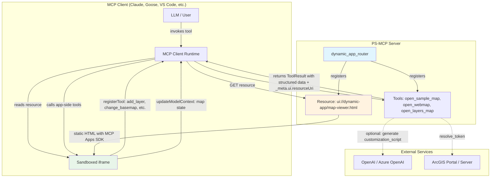
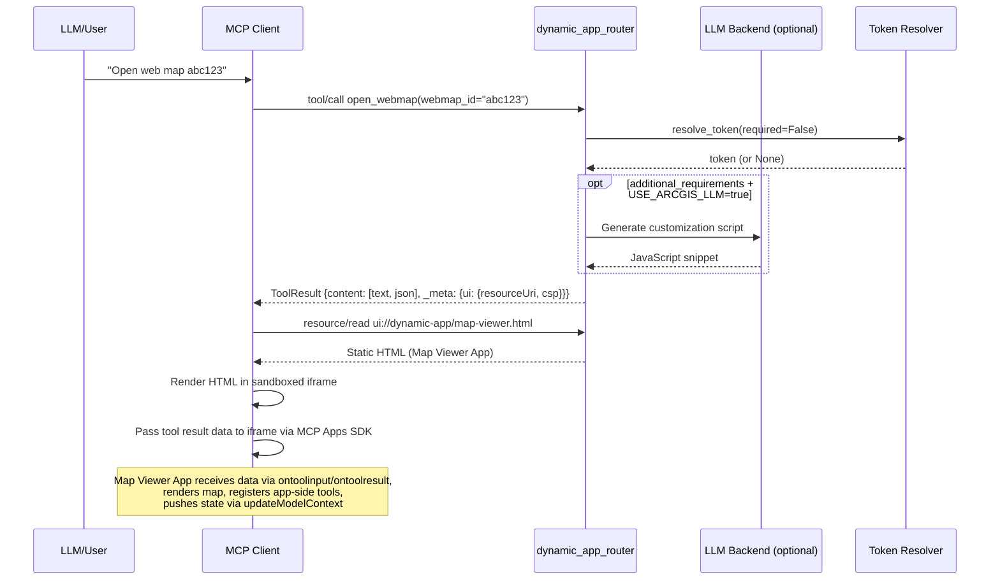
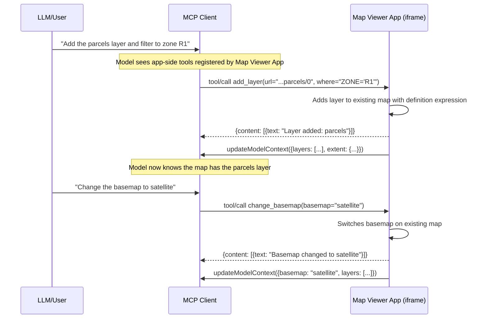

# Design Document: Dynamic Application Router

## Overview

The Dynamic Application Router (`psmcp-router-dynamic-app`) is a new PS-MCP router package that extracts the map-opening tools from the existing ArcGIS router and reimplements them using the MCP Apps standard. The key architectural shift is from **per-request HTML generation with in-memory state** to a **stateless, data-driven approach** where:

1. Tools return structured data (map parameters) + reference a single static `ui://` resource URI
2. A static Map Viewer App (HTML/JS) receives the tool result data via the MCP Apps SDK and renders maps dynamically
3. The Map Viewer App registers its own app-side tools (`add_layer`, `remove_layer`, `change_basemap`, `update_symbology`, `get_current_view`) that the model can call to incrementally update the running map
4. LLM-based customization generates JavaScript snippets (not full HTML pages) that are injected into the static viewer
5. The Map Viewer App pushes state back to the model via `updateModelContext()` so the model knows what's on the map

This design eliminates the `_pending_map_requests` in-memory dictionary, makes the router compatible with any MCP Apps-capable client (not just Goose), enables iterative map building through conversation, and cleanly separates map-opening concerns from the ArcGIS router's portal search/info responsibilities.

### Design Decisions

| Decision | Rationale |
|----------|-----------|
| Single static resource URI | MCP Apps standard requires a predictable `ui://` resource; all variation comes from tool result data |
| App-side tools for incremental updates | Allows the model to modify the running map (add layers, change symbology) without creating a new app instance — matches the MCP Apps bidirectional communication pattern |
| JavaScript snippets instead of full HTML | Reduces LLM token usage, eliminates HTML parsing/validation, keeps the static viewer as the single source of truth for structure |
| No in-memory state | Enables horizontal scaling, eliminates race conditions between tool calls and resource reads |
| `updateModelContext()` for state awareness | Gives the model visibility into current map state (layers, extent) so it can make informed decisions about subsequent tool calls |
| ArcGIS Maps SDK Web Components | Declarative API matches the existing LLM system prompt; simpler DOM manipulation from customization scripts |
| Separate package from arcgis router | Clean separation of concerns; arcgis router focuses on portal search/info/groups |

## Architecture



### Data Flow — Initial Map Creation



### Data Flow — Incremental Map Update


    participant Router as dynamic_app_router
    participant LLM as LLM Backend (optional)
    participant Auth as Token Resolver

    User->>Client: "Open web map abc123"
    Client->>Router: tool/call open_webmap(webmap_id="abc123")
    Router->>Auth: resolve_token(required=False)
    Auth-->>Router: token (or None)
## Components and Interfaces

### Package Structure

```
packages/psmcp-router-dynamic-app/
├── pyproject.toml
├── README.md
└── src/
    └── psmcp_router_dynamic_app/
        ├── __init__.py              → exports dynamic_app_router + __version__
        ├── _version.py              → auto-generated by hatch-vcs (gitignored)
        ├── service.py               → FastMCP instance, tools, resource registration
        ├── llm.py                   → LLM client setup, customization script generation
        ├── csp.py                   → CSP builder utility
        ├── schemas.py               → Tool result data schema (TypedDicts / dataclasses)
        └── viewer.py                → Map Viewer App HTML generation (static template)
```

### Module Responsibilities

#### `service.py` — Router Entry Point

- Creates `FastMCP(name="Dynamic App Router")` instance
- Registers three tools: `open_sample_map`, `open_webmap`, `open_layers_map`
- Registers one resource: `ui://dynamic-app/map-viewer.html`
- Orchestrates token resolution, LLM calls, CSP building, and ToolResult construction

#### `llm.py` — LLM Customization Script Generation

- Adapts the existing `arcgis_llm.py` pattern for snippet-only generation
- Provides `generate_customization_script(map_type, params, additional_requirements) -> str | None`
- Handles OpenAI / Azure OpenAI client creation
- System prompt focused on generating a JavaScript function body (not full HTML)
- Strips markdown code block delimiters from responses
- 60-second timeout on LLM calls

#### `csp.py` — Content Security Policy Builder

- `build_csp(portal_url=None, layer_urls=None) -> dict` — constructs the CSP object
- Baseline ArcGIS CDN domains always included
- Dynamically adds origins extracted from portal_url and layer_urls

#### `schemas.py` — Data Schemas

- `ToolResultData` TypedDict defining the JSON structure passed to the viewer
- Validation helpers for tool parameters

#### `viewer.py` — Static Map Viewer HTML

- `get_viewer_html() -> str` — returns the complete self-contained HTML string
- The HTML includes inline JS that:
  - Imports the MCP Apps SDK from CDN
  - Connects to the host via `app.connect()`
  - Handles `ontoolinput` for streaming tool arguments (initial map setup)
  - Handles `ontoolresult` for final tool result data (viewUUID for state persistence)
  - Parses the `type` field and renders the appropriate map
  - Executes `customization_script` if present
  - Registers tokens with IdentityManager if present
  - **Registers app-side tools** for incremental map updates:
    - `add_layer(url, where_clause?, token?, token_servers?)` — adds a layer to the existing map
    - `remove_layer(url_or_index)` — removes a layer by URL or index
    - `change_basemap(basemap)` — switches the basemap
    - `update_symbology(url_or_index, renderer)` — applies a renderer to a layer
    - `get_current_view()` — returns current extent, layers, basemap
  - Calls `app.updateModelContext()` after each state change with current map state
  - Handles `app.onteardown` for cleanup

### Key Interfaces

```python
# service.py — Tool signatures
async def open_sample_map(
    additional_requirements: str | None = None,
) -> ToolResult: ...

async def open_webmap(
    webmap_id: str,
    portal_url: str | None = None,
    additional_requirements: str | None = None,
) -> ToolResult: ...

async def open_layers_map(
    layer_urls: list[str],
    layer_where_clauses: list[str] | None = None,
    additional_requirements: str | None = None,
) -> ToolResult: ...

# llm.py
async def generate_customization_script(
    map_type: str,
    map_params: dict,
    additional_requirements: str,
) -> str | None: ...

# csp.py
def build_csp(
    portal_url: str | None = None,
    layer_urls: list[str] | None = None,
) -> dict[str, list[str]]: ...

# viewer.py
def get_viewer_html() -> str: ...

# schemas.py
def build_tool_result_data(
    map_type: str,
    *,
    webmap_id: str | None = None,
    portal_url: str | None = None,
    layer_urls: list[str] | None = None,
    layer_where_clauses: list[str] | None = None,
    token: str | None = None,
    token_servers: list[str] | None = None,
    customization_script: str | None = None,
    additional_requirements: str | None = None,
) -> dict: ...
```

### ToolResult Construction Pattern

Every tool returns a `ToolResult` with this structure:

```python
ToolResult(
    content=[
        TextContent(type="text", text="<human-readable description>"),
        TextContent(type="text", text=json.dumps(tool_result_data)),
    ],
    meta={
        "ui": {
            "resourceUri": "ui://dynamic-app/map-viewer.html",
            "csp": build_csp(portal_url=..., layer_urls=...),
        },
    },
)
```

## Data Models

### Tool Result Data Schema

```json
{
  "type": "sample_map" | "webmap" | "layers_map",
  
  // Required for type=webmap
  "webmap_id": "string",
  "portal_url": "string (URL)",
  
  // Required for type=layers_map
  "layer_urls": ["string (URL)", ...],        // 1-50 items
  "layer_where_clauses": ["string", ...],     // optional, same length as layer_urls
  
  // Optional common fields
  "token": "string",                          // ArcGIS auth token
  "token_servers": ["string (URL)", ...],     // servers to register token with
  "customization_script": "string",           // JS function body, max 50,000 chars
  "additional_requirements": "string"         // original NL text, max 2,000 chars
}
```

### Python Schema (TypedDict)

```python
from typing import TypedDict, NotRequired

class ToolResultData(TypedDict):
    type: str  # "sample_map" | "webmap" | "layers_map"
    
    # webmap fields
    webmap_id: NotRequired[str]
    portal_url: NotRequired[str]
    
    # layers_map fields
    layer_urls: NotRequired[list[str]]
    layer_where_clauses: NotRequired[list[str]]
    
    # common optional fields
    token: NotRequired[str]
    token_servers: NotRequired[list[str]]
    customization_script: NotRequired[str]
    additional_requirements: NotRequired[str]
```

### CSP Metadata Schema

```python
class CspMetadata(TypedDict):
    connectDomains: list[str]
    resourceDomains: list[str]
    scriptDomains: list[str]
    styleDomains: list[str]
```

Baseline values:

```python
BASELINE_CSP: CspMetadata = {
    "connectDomains": [
        "https://js.arcgis.com",
        "https://services.arcgisonline.com",
        "https://basemaps.arcgis.com",
        "https://cdn.arcgis.com",
        "https://static.arcgis.com",
    ],
    "resourceDomains": [
        "https://js.arcgis.com",
        "https://cdn.arcgis.com",
        "https://static.arcgis.com",
    ],
    "scriptDomains": [
        "https://js.arcgis.com",
    ],
    "styleDomains": [
        "https://js.arcgis.com",
    ],
}
```

### Token Server Derivation

Reuses the logic from `arcgis_resources._derive_token_registration_server()`:

```
Input URL: https://portal.example.com/portal/sharing/rest/content/items/abc
Output:    https://portal.example.com/portal

Input URL: https://maps.example.com/server/rest/services/MyService/MapServer
Output:    https://maps.example.com/server
```

Rule: Extract `scheme://host/first_path_segment` from URLs containing `/rest`.

### Environment Variables

| Variable | Required | Default | Description |
|----------|----------|---------|-------------|
| `ARCGIS_PORTAL_URL` | No | `https://www.arcgis.com` | Fallback portal URL for webmap tool |
| `USE_ARCGIS_LLM` | No | `"false"` | Enable LLM customization script generation |
| `OPENAI_KEY` | When LLM enabled | — | API key for OpenAI/Azure |
| `OPENAI_BASE_URL` | No | `https://api.openai.com/v1` | API base URL |
| `OPENAI_MODEL` | No | `gpt-4o` | Model name (standard OpenAI) |
| `AZURE_OPENAI` | No | `"false"` | Use Azure OpenAI client |
| `AZURE_OPENAI_API_VERSION` | No | `2024-02-15-preview` | Azure API version |
| `AZURE_OPENAI_DEPLOYMENT` | No | value of `OPENAI_MODEL` | Azure deployment name |


## Correctness Properties

*A property is a characteristic or behavior that should hold true across all valid executions of a system — essentially, a formal statement about what the system should do. Properties serve as the bridge between human-readable specifications and machine-verifiable correctness guarantees.*

### Property 1: Static Resource URI Invariant

*For any* valid tool invocation (open_sample_map, open_webmap, or open_layers_map) with any valid parameters, the returned ToolResult `_meta.ui.resourceUri` SHALL always equal `"ui://dynamic-app/map-viewer.html"`.

**Validates: Requirements 2.2, 2.4**

### Property 2: CSP Baseline Domains Always Present

*For any* valid tool invocation with any parameters, the returned CSP object SHALL contain all baseline ArcGIS CDN domains: `js.arcgis.com` in connectDomains, resourceDomains, scriptDomains, and styleDomains; `services.arcgisonline.com` and `basemaps.arcgis.com` in connectDomains; `cdn.arcgis.com` and `static.arcgis.com` in connectDomains and resourceDomains.

**Validates: Requirements 2.3, 9.1, 9.2**

### Property 3: CSP Dynamic Domain Addition

*For any* portal URL or layer URL passed to `build_csp`, the origin (scheme + host) of that URL SHALL appear in both the `connectDomains` and `resourceDomains` arrays of the returned CSP object.

**Validates: Requirements 2.6, 9.3, 9.4**

### Property 4: Tool Result Data Preserves Input Parameters

*For any* valid tool invocation, the JSON-encoded Tool_Result_Data in the response SHALL contain the exact input values: for open_webmap, the `webmap_id` and `portal_url` fields match the inputs; for open_layers_map, the `layer_urls` field matches the input list; for all tools, `additional_requirements` (when provided) matches the input string.

**Validates: Requirements 5.4, 6.2, 11.7**

### Property 5: Schema Validity Invariants

*For any* Tool_Result_Data produced by the router: (a) the `type` field is always present and is one of `"sample_map"`, `"webmap"`, or `"layers_map"`; (b) if type is `"webmap"` then `webmap_id` and `portal_url` are non-empty strings; (c) if type is `"layers_map"` then `layer_urls` is a list of 1-50 non-empty strings; (d) if `token` is present then `token_servers` is also present and non-empty.

**Validates: Requirements 11.1, 11.2, 11.3, 11.5**

### Property 6: Token Server Derivation

*For any* URL string containing `/rest` with a valid scheme, host, and at least one path segment, `_derive_token_registration_server` SHALL return `scheme://host/first_path_segment`. For URLs not containing `/rest`, it SHALL return `None`.

**Validates: Requirements 8.2**

### Property 7: Markdown Code Block Stripping

*For any* string `s`, if `s` is wrapped with ` ```html ` prefix and ` ``` ` suffix, or just ` ``` ` prefix and ` ``` ` suffix, then `_clean_llm_response(s)` SHALL return the inner content with delimiters removed and whitespace trimmed. If `s` has no markdown delimiters, the result SHALL equal `s.strip()`.

**Validates: Requirements 7.7**

### Property 8: Invalid Parameters Produce Error Results

*For any* invocation of open_webmap with an empty or whitespace-only `webmap_id`, or open_layers_map with an empty `layer_urls` list, or open_layers_map with `layer_where_clauses` whose length differs from `layer_urls`, the tool SHALL return a result with `isError: true` and a non-empty error message string.

**Validates: Requirements 5.7, 6.6, 12.1**

### Property 9: Resource Content Idempotence

*For any* number of sequential calls to `get_viewer_html()`, the returned HTML string SHALL be identical across all calls.

**Validates: Requirements 3.5**

### Property 10: App-Side Tool Registration

*For any* valid initial tool result received by the Map Viewer App, after initialization completes, the app SHALL have registered at least the following tools with the host: `add_layer`, `remove_layer`, `change_basemap`, `update_symbology`, `get_current_view`.

**Validates: Requirements 13.1, 13.2, 13.3, 13.4, 13.5, 13.6**

### Property 11: Incremental Layer Addition Preserves Existing Layers

*For any* sequence of `add_layer` calls with valid URLs, the map SHALL contain all previously added layers plus the new one — no existing layers are removed or replaced.

**Validates: Requirements 13.2**

## Error Handling

### Tool-Level Errors

| Error Condition | Behavior | HTTP/MCP Status |
|----------------|----------|-----------------|
| Empty/whitespace `webmap_id` | Return `isError: true` with message | Tool error result |
| No portal URL available (no param, no env var) | Return `isError: true` with message | Tool error result |
| Empty `layer_urls` list | Return `isError: true` with message | Tool error result |
| `layer_where_clauses` length ≠ `layer_urls` length | Return `isError: true` with message | Tool error result |
| `additional_requirements` > 2000 chars | Return `isError: true` with message | Tool error result |
| `layer_urls` > 50 items | Return `isError: true` with message | Tool error result |

### LLM Errors (Graceful Degradation)

| Error Condition | Behavior |
|----------------|----------|
| `OPENAI_KEY` not set when LLM enabled | Log WARNING, return result without `customization_script` |
| LLM API timeout (>60s) | Log WARNING, return result without `customization_script` |
| LLM API network error | Log WARNING, return result without `customization_script` |
| LLM returns invalid/empty response | Log WARNING, return result without `customization_script` |

The router never fails a tool call due to LLM errors — it degrades gracefully by omitting the customization script.

### Client-Side Errors (Map Viewer App)

| Error Condition | Behavior |
|----------------|----------|
| Missing `type` field in tool result data | Display error message in viewer |
| Unrecognized `type` value | Display error message indicating unsupported type |
| Missing required fields for type (e.g., no `webmap_id` for webmap) | Display error message |
| Map layer loading failure | Display error message indicating which layer failed |
| ArcGIS SDK initialization failure | Display error message |
| `add_layer` with invalid URL | Return `isError: true` from app-side tool |
| `remove_layer` with non-existent layer | Return `isError: true` from app-side tool |
| `update_symbology` with invalid renderer JSON | Return `isError: true` from app-side tool |
| `change_basemap` with unrecognized basemap name | Return `isError: true` from app-side tool |

### Logging Strategy

- **ERROR level**: Tool parameter validation failures, unexpected exceptions
- **WARNING level**: LLM failures (graceful degradation), token resolution failures
- **INFO level**: Tool invocations, LLM calls initiated, resource reads
- **DEBUG level**: Full tool parameters, LLM prompts/responses, CSP construction details

All log calls use lazy formatting: `logger.info("Processing %s with %d layers", map_type, len(urls))`

## Testing Strategy

### Dual Testing Approach

This feature uses both unit tests and property-based tests for comprehensive coverage:

- **Property-based tests** (via `hypothesis`): Verify universal properties across randomized inputs — CSP construction, schema invariants, token derivation, parameter validation
- **Unit tests** (via `pytest`): Verify specific examples, integration points, error conditions, and client-side HTML structure

### Property-Based Testing Configuration

- **Library**: `hypothesis` (Python PBT standard)
- **Minimum iterations**: 100 per property test
- **Tag format**: `# Feature: dynamic-application-router, Property {N}: {title}`

Each correctness property maps to a single property-based test:

| Property | Test Target | Key Generators |
|----------|-------------|----------------|
| 1: Static Resource URI | `open_sample_map`, `open_webmap`, `open_layers_map` | Random valid params per tool |
| 2: CSP Baseline | `build_csp()` | Random portal_url, layer_urls combinations |
| 3: CSP Dynamic Domains | `build_csp(portal_url, layer_urls)` | Random HTTP/HTTPS URLs |
| 4: Data Preservation | All tools | Random webmap_ids, URLs, requirements text |
| 5: Schema Validity | `build_tool_result_data()` | Random valid type + params |
| 6: Token Server Derivation | `_derive_token_registration_server()` | Random URLs with/without /rest |
| 7: Markdown Stripping | `_clean_llm_response()` | Random strings with/without markdown wrappers |
| 8: Invalid Params → Error | All tools | Random invalid inputs (empty strings, mismatched lists) |
| 9: Resource Idempotence | `get_viewer_html()` | No input variation needed (call N times) |

### Unit Test Coverage

| Area | Tests |
|------|-------|
| Package structure | Import, entry point discovery, __version__ |
| Tool happy paths | Each tool with minimal valid params |
| Tool error paths | Each validation error condition |
| LLM integration | Mock OpenAI client, verify prompt construction, response cleaning |
| LLM failure handling | Mock exceptions, verify graceful degradation |
| Token resolution | Mock resolve_token, verify inclusion/exclusion |
| Viewer HTML structure | Verify SDK imports, ontoolinput handler, type dispatch, app-side tool registration |
| App-side tools in viewer | Verify `add_layer`, `remove_layer`, `change_basemap`, `update_symbology`, `get_current_view` are registered in HTML |
| Model context updates | Verify `updateModelContext` calls are present in viewer HTML after state changes |
| CSP construction | Specific URL examples, deduplication |
| ArcGIS router cleanup | Verify removed tools/resources/modules |

### Test Dependencies

```toml
[project.optional-dependencies]
dev = [
    "pytest>=8.0",
    "pytest-asyncio>=0.23",
    "hypothesis>=6.100",
]
```

### Mocking Strategy

- **LLM calls**: Mock `AsyncOpenAI` / `AsyncAzureOpenAI` client at the module level
- **Token resolution**: Mock `resolve_token` to return controlled values
- **No external HTTP calls**: All tests run without network access
